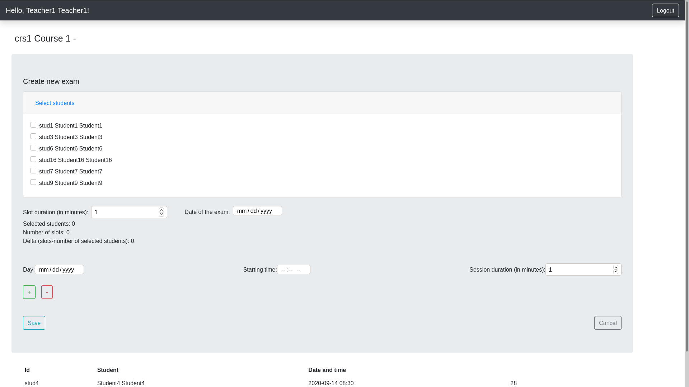
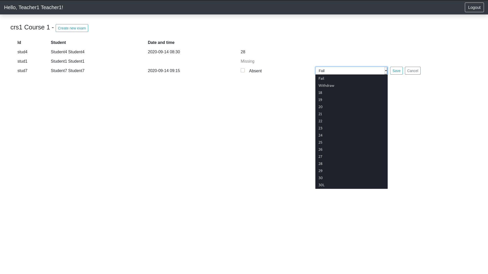
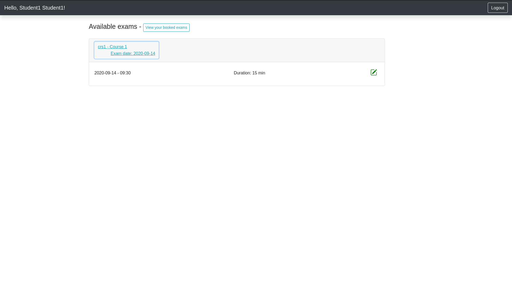
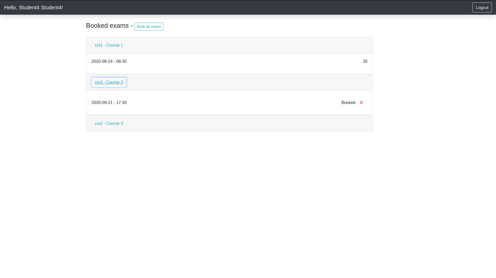

# Oral exams scheduling website

Teachers and students can manage easily their exam bookings with this React-based client/server website.
Teachers can schedule different exam dates and decide which students can attend it. 
Students will find in their personal page all the booked exams (with the possibility to unbook it) along with the final grade (if provided) 
and all the available exam calls for which they've been selected. 
The teachers' access is password based, the server memorizes only the hash of them (using the bcrypt library).

## Screenshot

## React client application routes

- Route `/`: Home page of the application, contains the login form
- Route `/students/:id`: Page for all the student's operations. `:id` is the identification code of the student.
- Route `/teachers/:id`: Page for all the teacher's operations. `:id` is the identification code of the teacher.

## REST API server

- POST `/api/login`
  - Request body contains username and password submitted by the user
  - Returns an object with status and description of the login attemp
- GET `/api/students/:id`
  - `:id` Id of the student
  - Returns id, name and surname of the requested student or an error message

- GET `/api/students/:id/exams`
  - `:id` Id of the student
  - Returns id, slotDate, slotHour, mark and name of the student's booked slots or an error message

- GET `/api/students/:id/slots`
  - `:id` Id of the student
  - Returns id, name, slotDate, slotHour, duration and examDate of the student's available slots or an error message

- PUT `/api/students/:id/slots`
  - `:id` Id of the student
  - Request body containes studId, courseId, slotDate and slotHour of the booked slot
  - Returns '200' or 'Database error'

- POST `/api/logout`
  - Returns a cookie cleared "200 OK" packet

- GET `/api/teachers/:id`
  - `:id` Id of the teacher
  - Returns teacherName, surname, id and courseName of the requested teacher or an error message

- GET `/api/teachers/:id/courses/:course/overview`
  - `:id` Id of the teacher
  - `:course` Course code
  - Returns studId, name, surname, slotDate, slotHour, mark and Date of all the selected student's slots or an error message

- GET `/api/teachers/:id/courses/:course/selectables`
  - `:id` Id of the teacher
  - `:course` Course code
  - Returns id, name and surname of all the selectable students for the course selected or an error message

- POST `/api/teachers/:id/courses/:course/slots`
  - `:id` Id of the teacher
  - `:course` Course code
  - Returns an empty packet with the status code properly set

- PUT `/api/teachers/:id/courses/:course/slots`
  - `:id` Id of the teacher
  - `:course` Course code
  - Request body contains studId, courseId, mark, slotDate and slotHour of the slot to be modified
  - Returns an empty packet with the status code properly set

## Server database

- Table `Student` - contains id, name and surname of all the students
- Table `Teacher` - contains id, name, surname, courseId and password of all the teachers
- Table `Course`  - contains id, name and teacherId of all the courses
- Table `Slot`    - contains courseId, slotDate, slotHour, duration, studId, mark and examDate of all the existing slots (mark is null if the slot is booked but the exam hasn't took place yet, both studId and mark are null if the slot isn't booked yet)
- Table `SelectedStudent` - contains studId, courseId and date of a student who is selected for a call(date) of a given course(courseId)
- Table `Enrollment` - contains studId, courseId and passed flag of all the enrollments of the university. The field `passed` is used for knowing if the student has passed the exam.

## Main React Components

- `LoginForm` (in `HomeComponents.js`): renders the correct login form (student/teacher) and displays any login or authentication problem
- `HomeStudent` (in `StudentComponents.js`): landing component from the student login, renders all the main components in the student page
- `ExamsBook` (in `StudentComponents.js`): view of the bookable slots (grouped by exam date)
- `ExamsView` (in `StudentComponents.js`): view of all the booked slots, including those which have a mark (of any kind)
- `HomeTeacher` (in `TeacherComponents.js`): landing component from the teacher login, renders all the main components in the teacher page
- `NewExamForm` (in `TeacherComponents.js`): contains all the form elements that help in the exam creation. It also holds in its state every detail of the exam retrieved from the subcomponents which receive the change value function. NewExamForm is also responsible of the validity checks before the exam creation
- `StudentList` (in `TeacherComponents.js`): renders a table which contains every selected student along with the information about the booking state and the mark. If a student is booked it shows the commands to take the exam and register a mark.

## Test users
##### Teachers (username,password)
* teach1 teach1pass
* teach2 teach2pass
* teach3 teach3pass 

##### Students(username) divided by course

crs1
* stud4
* stud7
* stud1
* stud8

crs2
* stud22
* stud17
* stud21
* stud4

crs3
* stud10
* stud4
* stud19
* stud1
